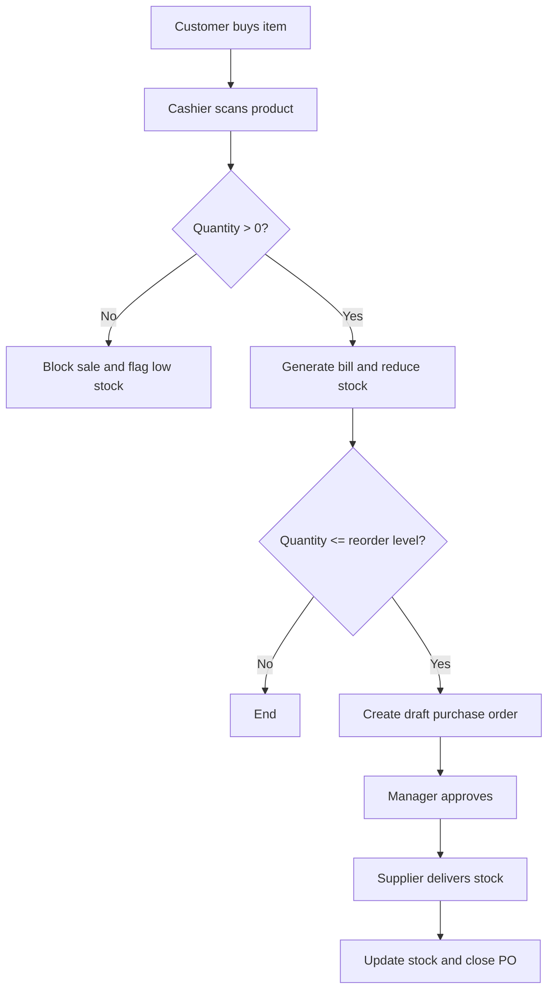

# Sales and Reorder Workflow

```mermaid
flowchart TD
    A[Customer buys item] --> B[Cashier scans product]
    B --> C{Quantity > 0?}
    C -- No --> D[Block sale and flag low stock]
    C -- Yes --> E[Generate bill and reduce stock]
    E --> F{Quantity <= reorder level?}
    F -- No --> G[End]
    F -- Yes --> H[Create draft purchase order]
    H --> I[Manager approves]
    I --> J[Supplier delivers stock]
    J --> K[Update stock and close PO]
```
